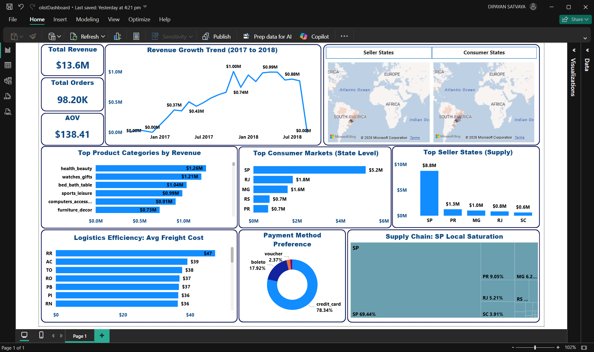

# 📦 Olist E-Commerce Supply Chain Analytics



## 🚀 Executive Summary
**Project Goal:** Design a scalable Data Warehouse to analyze the supply chain efficiency of a Brazilian marketplace (Olist) handling 100k+ orders.

**Key Insight:** Analysis revealed that **São Paulo (SP)** acts as a massive "Net Exporter" for the Brazilian e-commerce ecosystem.
* **Supply vs. Demand:** SP Sellers generate **$8.8M** in revenue (Supply), while SP Customers only consume **$5.2M** (Demand), creating a **$3.6M trade surplus**.
* **Self-Sufficiency:** **69.4%** of local demand is met by local sellers, driven by a **30% logistics cost advantage** compared to other states.

---

## 🛠 Tech Stack
* **Database:** PostgreSQL (Data Warehouse Storage)
* **ETL & Modeling:** Python (Pandas, SQLAlchemy), SQL (Complex Joins, Views, Window Functions)
* **Visualization:** Power BI (Star Schema, DAX, Interactive Dashboard)
* **Concepts:** Dimensional Modeling (Kimball), Bronze/Silver/Gold Architecture, Data Cleaning

---

## 🏆 The "STAR" Analysis (Project Walkthrough)

### 1. Situation (The Problem)
The raw Olist dataset consisted of **9 scattered CSV files** (Orders, Customers, Payments, Geolocation) with significant data quality issues:
* Inconsistent text formatting (`sao paulo` vs `São Paulo`).
* "Ghost" categories (NULL translations).
* High cardinality in geolocation data (1M+ rows for ~4k zip codes).
* No clear link between "Sellers" and "Customers" to analyze local supply chains.

### 2. Task (The Objective)
Build a **clean, centralized Data Warehouse** to answer a specific business question:
*"How much of the revenue generated in major states is retained by local sellers, and does logistics cost drive this behavior?"*

### 3. Action (The Solution)
I engineered a **Three-Layer Architecture**:
* **Bronze Layer (Ingestion):** Built a Python script (`ingest_db.py`) to enforce strict schema types and load raw CSVs into PostgreSQL.
* **Silver Layer (Cleaning & Logic):** Created SQL Views to standardise text (INITCAP), deduplicate Geolocation data (Centroid logic), and translate categories.
    * *Key SQL Feature:* Used `COALESCE` to fix missing product names and `GROUP BY` to flatten the geolocation table.
* **Gold Layer (Star Schema):** Designed a dimensional model in Power BI, linking `fact_orders` to `dim_customers`, `dim_sellers`, and `dim_products`.

### 4. Result (The Impact)
* **Quantified Market Dominance:** Proven that São Paulo is a **Net Exporter**, selling $8.8M in goods but only consuming $5.2M.
* **Operational Insight:** Identified that **Logistics Costs** are the primary driver of local commerce. Shipping within SP costs **$14.00**, whereas cross-state shipping to the North averages **$35.00+**.
* **Financial Clarity:** Visualized that **78% of volume** flows through Credit Cards, aiding cash flow forecasting.

---

## 📂 Repository Structure
```text
olist-analytics/
├── src/
│   ├── ingestion/          # Python scripts for loading raw CSVs to Postgres
│   ├── sql/                # SQL scripts for Cleaning Views & Analysis
│   │   ├── create_clean_views.sql  # The Silver Layer logic
│   │   └── revenue_analysis.sql    # Validation queries
│   └── dashboard/          # Power BI file (.pbix) and export scripts
├── data/                   # (Raw data not included due to size)
├── screenshots/            # Images of the final dashboard
└── README.md               # Project Documentation
